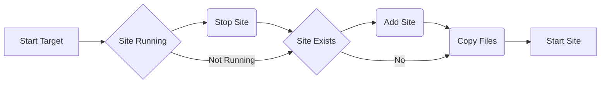

# IIS Site Updater

IIS Site Updater is a command line tool to create or update IIS web sites.  Using dot net core [Microsoft.Web.Administration](https://docs.microsoft.com/en-us/dotnet/api/microsoft.web.administration?view=iis-dotnet) to manage IIS sites and app pools.  Site Updater will copy project directories from a source directory to the IIS Manager physical path defined in IIS Site definition.  This tool can use either command line arguments or appSettings.json as an input for command parameters.

***NOTE: This tool must be run with administrator privileges.***

# Configuration
IIS Site update can accept parameters from either the command line or it can read them from the appSettings.json

## Command Line

### Usage:
    SiteUpdater [--siteName=iiswebsite --port=80, --source==c:\\source --destination=c:\\destination]
  
**siteName** - The name of the site to update/create
	**port** - The port of the site
	**source** - The source folder to copy the application from (excluding sitename)
	**destination** - The folder for the site, aka the destination of the updated files

## AppSettings.json

    {
    Source": "H:\\transfer\\Services
    Destination": "D:\\TEST\\Services
      "Targets": {
        "testsite1": "8081",
        "testsite2": "8082",
      },
    }  

**Source** - The root source directory for all the targets listed below (i.e. H:\Transfer\Service with target site 'testsite1' would expect all site files in a directory H:\Transfer\Service\testsite1)
**Destination** -  The root destination directory for all the targets listed below (i.e. D:\Test\Service with target site 'testsite1' would copy all site files to a directory D:\Test\Service\testsite1)
**Targets**
	
Targets are listed by name with a value of the assigned port
 1. "**SiteName** ": 	"**Port**"

# Logging
IIS Site Updater uses [Serilog](https://github.com/serilog/serilog/) to control logging.  All configuration parameters are read from appSettings.json.  The default installation will log ***Verbose*** level events to the console, a standard log file, and a json formatted logfile.  
Note: For a more compact log change MinimumLevel to Information
 

     "Serilog": {
        "Using": [ "Serilog.Sinks.Console", "Serilog.Sinks.File", "Serilog.Sinks.RollingFile" ],
        "MinimumLevel": "Verbose",
        "WriteTo": [
          {
            "Name": "Console",
            "Args": {
              "theme": "Serilog.Sinks.SystemConsole.Themes.SystemConsoleTheme::Literate, Serilog.Sinks.Console",
            }
          },
          {
            "Name": "File",
            "Args": {
              "path": "SiteUpdater.log",
              "outputTemplate": "{Timestamp:yyyy-MM-dd HH:mm:ss.fff} [{Level}] {Message}{NewLine}{Exception}",
              "rollingInterval": "Day"
    
            }
          },
          {
            "Name": "RollingFile",
            "Args": {
              "pathFormat": "SiteUpdater-log-{Date}.json",
              "formatter": "Serilog.Formatting.Compact.CompactJsonFormatter, Serilog.Formatting.Compact",
              "textFormatter": "JsonFormatter",
              "fileSizeLimitBytes": 2147483648,
              "retainedFileCountLimit": 5
            }
          }
        ],
        "Enrich": [ "FromLogContext", "WithMachineName", "WithThreadId", "WithExceptionDetails" ],
      }

## Console
See [Serilog-Sink-Console](https://github.com/serilog/serilog-sinks-console) for more information

## File
See [Serilog-Sink-File](https://github.com/serilog/serilog-sinks-file) for more information

## Json
See [Serilog-Formatting-Compact](https://github.com/serilog/serilog-formatting-compact) for more information

## Log Levels

`Verbose`

Verbose is the noisiest level, rarely (if ever) enabled for a production app.

`Debug`

Debug is used for internal system events that are not necessarily observable from the outside, but useful when determining how something happened.

`Information`

Information events describe things happening in the system that correspond to its responsibilities and functions. Generally these are the observable actions the system can perform.

`Warning`

When service is degraded, endangered, or may be behaving outside of its expected parameters, Warning level events are used.

`Error`

When functionality is unavailable or expectations broken, an Error event is used.

`Fatal`

The most critical level, Fatal events demand immediate attention.

# Work Flow

flow chart:

